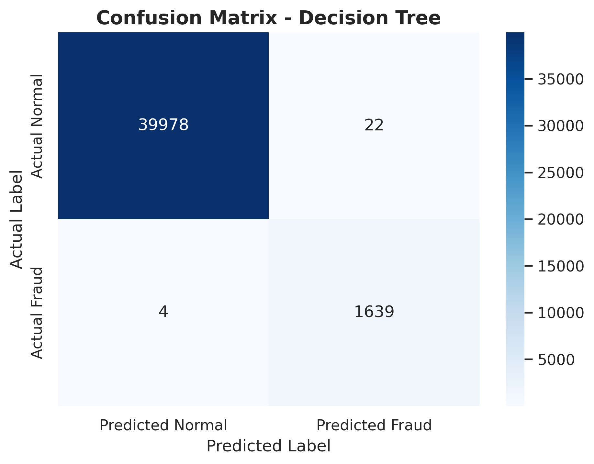

# UPI Shield AI — Transaction Risk Scoring System

A machine learning-based digital payment fraud risk scoring system that predicts whether a transaction is safe or suspicious and provides a fraud probability, risk score, risk level, explanation, and recommended action.

---

## Project Overview

Digital payment systems such as UPI, wallets, and online banking have made financial transactions faster and easier. However, the increase in digital transactions has also increased the risk of fraudulent activities.

This project builds a machine learning-based transaction risk scoring system that analyzes transaction type, transaction amount, sender balance, receiver balance, and balance movement patterns to identify suspicious transactions.

Unlike a basic fraud detection project that only predicts `Fraud` or `Not Fraud`, this system provides:

* Fraud probability
* Risk score out of 100
* Risk level: Low, Medium, or High
* Human-readable risk reasons
* Recommended action for the transaction

---

## Project Name

**UPI Shield AI — Transaction Risk Scoring System**

---

## Problem Statement

The objective of this project is to build a machine learning system that can detect suspicious digital payment transactions and assign a risk score based on transaction behavior.

The system helps identify potentially fraudulent transactions by analyzing:

* Transaction type
* Transaction amount
* Sender balance before and after transaction
* Receiver balance before and after transaction
* Balance difference patterns
* Balance error patterns
* High-risk transaction behavior

---

## Key Features

* Machine learning-based fraud detection
* Risk score generation from fraud probability
* Low, Medium, and High risk classification
* Explainable risk reasons
* Recommended action for each transaction
* Streamlit-based interactive web application
* Model comparison using multiple ML algorithms
* Professional notebook-based ML pipeline
* GitHub-ready project structure

---

## Tech Stack

| Category             | Tools / Libraries       |
| -------------------- | ----------------------- |
| Programming Language | Python                  |
| Data Handling        | Pandas, NumPy           |
| Visualization        | Matplotlib, Seaborn     |
| Machine Learning     | Scikit-learn            |
| Imbalance Handling   | SMOTE, Imbalanced-learn |
| Advanced ML Model    | XGBoost                 |
| Model Saving         | Joblib                  |
| Web App              | Streamlit               |
| Dataset Source       | Kaggle PaySim Dataset   |
| Version Control      | Git, GitHub             |

---

## Machine Learning Workflow

The project follows a complete end-to-end machine learning workflow:

```text
Dataset Download
        ↓
Data Understanding
        ↓
Exploratory Data Analysis
        ↓
Feature Engineering
        ↓
Train-Test Split
        ↓
SMOTE on Training Data
        ↓
Model Training
        ↓
Model Evaluation
        ↓
Best Model Selection
        ↓
Risk Scoring Logic
        ↓
Streamlit Application
```

---

## Folder Structure

```text
UPI-Shield-AI-Transaction-Risk-Scoring/
│
├── app/
│   └── streamlit_app.py
│
├── data/
│   ├── raw/
│   │   └── .gitkeep
│   └── processed/
│       └── .gitkeep
│
├── models/
│   └── .gitkeep
│
├── notebooks/
│   ├── 01_data_understanding.ipynb
│   ├── 02_eda_visualization.ipynb
│   ├── 03_feature_engineering.ipynb
│   ├── 04_model_training.ipynb
│   └── 05_model_evaluation.ipynb
│
├── reports/
│   └── .gitkeep
│
├── screenshots/
│   └── .gitkeep
│
├── src/
│
├── .streamlit/
│   └── config.toml
│
├── .gitignore
├── requirements.txt
└── README.md
```

---

## Dataset

This project uses the **PaySim Synthetic Financial Dataset for Fraud Detection** from Kaggle.

The dataset simulates mobile money transactions and contains transaction-level features such as:

| Column           | Description                          |
| ---------------- | ------------------------------------ |
| `step`           | Time step of transaction             |
| `type`           | Type of transaction                  |
| `amount`         | Transaction amount                   |
| `oldbalanceOrg`  | Sender balance before transaction    |
| `newbalanceOrig` | Sender balance after transaction     |
| `oldbalanceDest` | Receiver balance before transaction  |
| `newbalanceDest` | Receiver balance after transaction   |
| `isFraud`        | Target column: 1 = Fraud, 0 = Normal |
| `isFlaggedFraud` | Rule-based fraud flag                |

### Dataset Note

The dataset file is not uploaded to this GitHub repository because it is large.

Download the dataset from Kaggle and place it inside:

```text
data/raw/
```

Rename the downloaded CSV file to:

```text
onlinefraud.csv
```

Expected path:

```text
data/raw/onlinefraud.csv
```

---

## Notebooks Description

### 1. Data Understanding

File:

```text
notebooks/01_data_understanding.ipynb
```

Purpose:

* Load the dataset
* Understand rows and columns
* Check missing values
* Check duplicate records
* Analyze fraud class distribution
* Understand transaction types

---

### 2. Exploratory Data Analysis

File:

```text
notebooks/02_eda_visualization.ipynb
```

Purpose:

* Visualize fraud vs normal transactions
* Analyze transaction type distribution
* Study fraud by transaction type
* Analyze transaction amount behavior
* Study sender and receiver balance patterns
* Create initial feature ideas

---

### 3. Feature Engineering

File:

```text
notebooks/03_feature_engineering.ipynb
```

Purpose:

* Create transaction behavior features
* Handle RAM-safe sampling
* Keep all fraud records and sample normal records
* Encode categorical variables
* Save processed dataset in Parquet format
* Save feature metadata

Engineered features include:

* `balanceDiffOrig`
* `balanceDiffDest`
* `errorBalanceOrig`
* `errorBalanceDest`
* `isZeroBalanceAfterTransaction`
* `isHighAmount`
* `hourOfDay`
* `isHighRiskType`
* `logAmount`
* `logBalanceDiffOrig`
* `logBalanceDiffDest`
* `logErrorBalanceOrig`
* `logErrorBalanceDest`

---

### 4. Model Training

File:

```text
notebooks/04_model_training.ipynb
```

Purpose:

* Load processed Parquet dataset
* Split data into train and test sets
* Apply SMOTE only on training data
* Train multiple machine learning models
* Compare model performance
* Save the best model

Models trained:

* Logistic Regression
* Decision Tree
* Random Forest
* XGBoost

---

### 5. Model Evaluation

File:

```text
notebooks/05_model_evaluation.ipynb
```

Purpose:

* Load best model
* Evaluate on test data
* Generate confusion matrix
* Plot ROC curve
* Plot Precision-Recall curve
* Analyze feature importance
* Test custom transactions
* Generate final evaluation reports

---

## Why SMOTE Was Used

Fraud detection datasets are highly imbalanced because fraud transactions are much fewer than normal transactions.

To handle this imbalance, SMOTE was applied only on the training data after train-test split.

Correct approach:

```text
Train-Test Split → SMOTE on Training Data → Train Model → Evaluate on Original Test Data
```

This prevents data leakage and ensures realistic evaluation.

---

## Models Used

| Model               | Purpose                         |
| ------------------- | ------------------------------- |
| Logistic Regression | Baseline model                  |
| Decision Tree       | Rule-based interpretable model  |
| Random Forest       | Ensemble model for tabular data |
| XGBoost             | High-performance boosting model |

---

## Evaluation Metrics

Accuracy alone is not enough for fraud detection because the dataset is imbalanced.

The project uses:

| Metric           | Importance                                                |
| ---------------- | --------------------------------------------------------- |
| Accuracy         | Overall correctness                                       |
| Precision        | How many predicted frauds were actually fraud             |
| Recall           | How many actual frauds were detected                      |
| F1-score         | Balance between precision and recall                      |
| ROC-AUC          | Model's ability to separate fraud and normal transactions |
| Confusion Matrix | Shows false positives and false negatives                 |

For fraud detection, recall is especially important because missing an actual fraud transaction can be costly.

---

## Risk Scoring Logic

The model predicts fraud probability.

The probability is converted into a risk score:

```text
Risk Score = Fraud Probability × 100
```

Risk levels:

| Risk Score | Risk Level  | Recommended Action                               |
| ---------- | ----------- | ------------------------------------------------ |
| 0–30       | Low Risk    | Allow transaction                                |
| 31–70      | Medium Risk | Ask for additional verification                  |
| 71–100     | High Risk   | Hold transaction and perform manual verification |

---

## Streamlit Application

The project includes a Streamlit web application where users can enter transaction details and get a risk prediction.

App file:

```text
app/streamlit_app.py
```

The app displays:

* Prediction
* Fraud probability
* Risk score
* Risk level
* Risk reasons
* Recommended action
* Model performance summary

---

## How to Run the Project Locally

### 1. Clone the Repository

```bash
git clone https://github.com/Swaraj08tech/UPI-Shield-AI-Transaction-Risk-Scoring.git
```

```bash
cd UPI-Shield-AI-Transaction-Risk-Scoring
```

---

### 2. Create Virtual Environment

```bash
python -m venv venv
```

Activate virtual environment:

For Windows:

```bash
venv\Scripts\activate
```

For macOS/Linux:

```bash
source venv/bin/activate
```

---

### 3. Install Requirements

```bash
pip install -r requirements.txt
```

---

### 4. Download Dataset

Download the PaySim fraud detection dataset from Kaggle.

Place the dataset in:

```text
data/raw/
```

Rename the CSV file to:

```text
onlinefraud.csv
```

Final path:

```text
data/raw/onlinefraud.csv
```

---

### 5. Run Notebooks

Run the notebooks in this order:

```text
01_data_understanding.ipynb
02_eda_visualization.ipynb
03_feature_engineering.ipynb
04_model_training.ipynb
05_model_evaluation.ipynb
```

After running the notebooks, the following files will be generated locally:

```text
data/processed/processed_fraud_data.parquet
data/processed/feature_list.json
models/best_model.pkl
reports/
screenshots/
```

---

### 6. Run Streamlit App

```bash
streamlit run app/streamlit_app.py
```

---

## Example Transaction

### High-Risk Example

| Field                | Value    |
| -------------------- | -------- |
| Transaction Type     | TRANSFER |
| Amount               | 95000    |
| Sender Old Balance   | 95000    |
| Sender New Balance   | 0        |
| Receiver Old Balance | 2000     |
| Receiver New Balance | 97000    |

Expected output:

```text
Prediction: Suspicious / Fraud
Risk Level: High Risk
Recommended Action: Hold transaction and perform manual verification.
```

---

## Screenshots

Add screenshots inside the `screenshots/` folder and update this section.

Example:

```markdown



```

---

## Project Highlights

* Designed a unique UPI-style transaction risk scoring system
* Converted fraud probability into risk score
* Added explainable rule-based risk reasons
* Handled imbalanced data using SMOTE
* Trained and compared multiple ML models
* Built an interactive Streamlit application
* Followed a clean notebook-based ML workflow
* Prepared project for GitHub and resume use

---

## Future Improvements

* Deploy the Streamlit app on Streamlit Cloud
* Add real-time API support using FastAPI
* Add user transaction history behavior analysis
* Add SHAP-based model explainability
* Add database support for transaction logging
* Improve risk thresholds based on business rules
* Add authentication for admin dashboard

---

## Author

**Swaraj Deogirkar**
AIML Student

GitHub: [Swaraj08tech](https://github.com/Swaraj08tech)

---

## License

This project is for educational and portfolio purposes.
